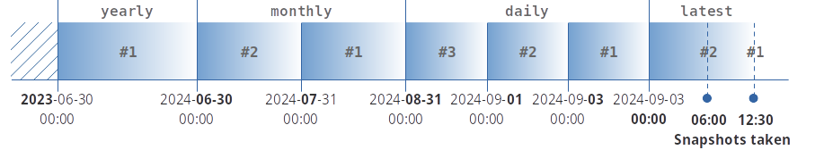

# Creating and rotating snapshots of Hetzner cloud servers

This script can perform the following tasks for selected servers of a [Hetzner cloud project](https://www.hetzner.com/cloud/):

- Creating a new snapshot
- Shutting down the server before taking a snapshot and restarting it thereafter
- Rotating snapshots, retaining a limited number of quarter-hourly, hourly, daily, weekly, monthly, quarterly and
  yearly snapshots
- Generating names of new and rotated snapshots from templates

These tasks can be configured independently per server in a [JSON configuration file](#creating-the-configuration-file).

Additional features:

- The secret API token can be read from the configuration file, from an environment variable or from `stdin`
- Log messages are sent to the console or to syslog


## Content

- [Generating an API token](#generating-an-api-token)
- [Installing this script](#installing-this-script)
- [Creating the configuration file](#creating-the-configuration-file)
  - [Taking snapshots](#taking-snapshots)
  - [Rotating snapshots](#rotating-snapshots)
  - [Snapshot name templates](#snapshot-name-templates)
- [Running the script natively](#running-the-script-natively)
  - [Command line options](#command-line-options)
  - [Passing the API token](#passing-the-api-token)
  - [Error handling](#error-handling)
  - [Creating and rotating snapshots in a cron job](#creating-and-rotating-snapshots-in-a-cron-job)
- [Running the script in a container](#running-the-script-in-a-container)
  - [Passing the configuration file to the container](#passing-the-configuration-file-to-the-container)
  - [Environment variables](#environment-variables)
  - [Examples](#examples)
- [Licenses](#licenses)


## Generating an API token

[This document](https://docs.hetzner.com/cloud/api/getting-started/generating-api-token/) describes in detail
how to generate an API token for your Hetzner cloud project. This script requires a token with "Read & Write"
permission.

Guard your API token well since it provides unlimited read/write/delete access to all servers, snapshots, backups etc. 
of your Hetzner cloud project!


## Installing this script

This script is available as a [PyPI project](https://pypi.org/project/hetzner-snap-and-rotate/). It can be installed by:

```shell
python3 -m pip install hetzner-snap-and-rotate
```


## Creating the configuration file

The configuration file is expected to be a JSON document in UTF-8 encoding with the following structure:

```
{
  "api-token": "...",          // optional, can also be passed via the command line;
                               // see section "Command line options" below

  "defaults": {                // optional defaults, can be overriden per server
      "create-snapshot":       // create a new snapshot whenever the script is invoked
        true,
      "snapshot-timeout":      // timeout (in s) after which snapshot creation is considered to have failed
         120,
      "snapshot-name":         // template for the snapshot name; see section "Snapshot name templates" below
        "{server}-{label[VERSION]}_{period_type}#{period_number}_{timestamp:%Y-%m-%d_%H:%M:%S}_by_{env[USER]}",
      "shutdown-and-restart":  // shut down the server before taking a snapshot
        true,                  // and restart it afterwards
      "shutdown-timeout":      // timeout (in s) after which graceful shutdown is considered to have failed
         15,
      "allow-poweroff":        // power off the server if it cannot be shut down gracefully
         false,
      "rotate":                // rotate the existing snapshots and the new one, if any 
         true,
      "quarter-hourly":        // number of quarter-hourly snapshots to retain (intended for testing)
         0,
      "hourly":                // number of hourly snapshots to retain
         2,
      "daily":                 // number of daily snapshots to retain
         3,
      "weekly":                // number of weekly snapshots to retain
         4,
      "monthly":               // number of monthly snapshots to retain
         3,
      "quarter-yearly":        // number of quarter-yearly snapshots to retain
         2,
      "yearly":                // number of yearly snapshots to retain
         1
    },

  "servers": {                 // one entry per server
    "server-1": {              // Hetzner cloud server name
                               // uses only "defaults" settings
    },

    "server-2": {              // another server; override a few defaults
      "snapshot-name": "snapshot_{timestamp:%Y-%m-%d_%H:%M:%S}",
      "snapshot-timeout": 300,
      "shutdown-timeout": 30,
      "allow-poweroff": true,

      "hourly": 0,
      "daily": 0,
      "monthly": 6,
      "quarter-yearly": 0,
      "yearly": 0
    }
  }
}
```

Omitted `defaults` default to `0`, `false` or `''` except for:

- `snapshot-timeout`: defaults to `300`
- `shutdown-timeout`: defaults to `30`

Please note that this is not valid JSON due to the comments.
File [resources/config-example.json](https://raw.githubusercontent.com/undecaf/hetzner-snap-and-rotate/refs/heads/main/resources/config-example.json) contains the same example
as a valid JSON file without comments.


### Taking snapshots

This script takes a snapshot of every `server` in the configuration file
for which `create-snapshot` is `true`. Each of these snapshots also stores a copy
of the current server labels.

If taking the snapshot takes longer than `snapshot-timeout` then that operation
is considered to have failed.

If `shutdown-and-restart` is `true` and the server is running
then the script attempts to shut down the server gracefully before taking the snapshot.
If the server cannot be shut down gracefully within the `shutdown-timeout` then it
will be powered down instead if `allow-poweroff` is `true`, or else the snapshot operation will fail.
If the server was running before taking the snapshot then it is restarted afterwards.


### Rotating snapshots

This script rotates the snapshots of every `server` in the configuration file
for which `rotate-snapshots` is `true`.

"Rotating" means that existing snapshots will be renamed
according to `snapshot-name`, or will be deleted if they
are no longer contained in any of the configured `quarter-hourly`, `hourly`, ... `yearly`
periods. Those settings determine for how many such periods the snapshots will be retained.

New snapshots that are _not yet_ contained in any rotation period will be renamed but not deleted.

Snapshots that have been protected are neither renamed nor deleted during rotation.
Nevertheless, they are taken into account in the rotation process.

Rotating snapshots is controlled by the following rules:

- Rotation period types (`quarter-hourly`, `hourly`, ... `yearly`) that were set to zero are ignored.
- Periods are counted backwards from the present towards the past.
- The first period is the shortest configured period that immediately precedes the instant of rotation.
- Other periods immediately precede the next shorter periods without gaps. If, for example, the rotation periods
  were set to `"daily": 3, "monthly": 2, "yearly": 1` then they would be arranged along the timeline like this
  if the latest snapshots had been taken on Sep 3, 2024 at 06:00 and 12:30:

  

  In this example, `daily` periods become aligned so that they immediately precede the snapshot instant;
  `monthly` periods become adjacent to `daily`, and `yearly` becomes adjacent to `monthly`, regardless of month and year
  boundaries.
- If a period contains multiple snapshots then only the oldest one will be retained for that period.
- All snapshots in the `latest` interval will be retained.
- New and rotated snapshots are (re)named according to the template `snapshot-name`. This allows the server name and 
  labels, the period, the snapshot timestamp and environment variables to become part of the snapshot name.  
See section [Snapshot name templates](#snapshot-name-templates) below for details.


### Snapshot name templates

`snapshot-name` must be a string and may contain [Python format strings](https://docs.python.org/3/library/string.html#format-string-syntax).
Snapshot names should be unique but this is not a requirement.
The following field names are available for formatting:

| Field name      |                                   Type                                    | Rendered as                                                                                                                                                                                                                                                                      |
|-----------------|:-------------------------------------------------------------------------:|----------------------------------------------------------------------------------------------------------------------------------------------------------------------------------------------------------------------------------------------------------------------------------|
| `server`        |                                   `str`                                   | Server name, same as `server` in the [configuration file](#creating-the-configuration-file)                                                                                                                                                                                      |
| `timestamp`     | [`datetime.datetime`](https://docs.python.org/3.10/library/datetime.html) | _Creation_ instant of the snapshot (_not changed by rotation_), expressed in the timezone of the system running this script. [`datetime`-specific formatting](https://docs.python.org/3.10/library/datetime.html#strftime-and-strptime-format-codes) may be used for this field. |
| `label`         |                                `dict[str]`                                | Value of a server label at the _creation_ instant of the snapshot (_not changed by rotation_), may be referred to as e.g. `label[VERSION]`                                                                                                                                       |
| `period_type`   |                                   `str`                                   | Type of period: `quarter-hourly`, `hourly`, ... `yearly`, or `latest` for new snapshots that have not been rotated yet                                                                                                                                                           |
| `period_number` |                                   `int`                                   | Rotation number of the period: `1` = latest, `2` = next to latest and so on; also applies to `latest` snapshots                                                                                                                                                                  |
| `env`           |                                `dict[str]`                                | Value of an environment variable at the creation or rotation instant of the snapshot, may be referred to as e.g. `env[USER]`                                                                                                                                                     |


## Running the script natively

```shell
python3 -m hetzner_snap_and_rotate [options ...]
```


### Command line options

| Option                                                                                   | Description                                                                                                                                                                               |
|------------------------------------------------------------------------------------------|-------------------------------------------------------------------------------------------------------------------------------------------------------------------------------------------|
| <code>--config <u>config_file</u></code><br><code>-c <u>config_file</u></code>           | Read the configuration from <code><u>config_file</u></code>. Default: `config.json`                                                                                                       |
| <code>--api-token-from <u>env_var</u></code><br><code>-t <u>env_var</u></code>           | Read the API token from environment variable <code><u>env_var</u></code>, or read it from `stdin` if `'-'` is specified. Default: get the API token from <code><u>config_file</u></code>. |
| <code>--facility <u>syslog_facility</u></code><br><code>-f <u>syslog_facility</u></code> | Send the log messages to <code><u>syslog_facility</u></code> (`SYSLOG`, `USER`, `DAEMON`, `CRON`, etc.). Default: send log messages to `stdout`.                                          |
| <code>--priority <u>pri</u></code><br><code>-p <u>pri</u></code>                         | Log only messages up to syslog priority <code><u>pri</u></code> (`ERR`, `WARNING`, `NOTICE`, `INFO`, `DEBUG`, or `OFF` to disable logging). Default: `NOTICE`.                            |
| `--dry-run`<br>`-n`                                                                      | Perform a trial run with no changes made. This requires only an [API token](#generating-an-api-token) with "Read" permission.                                                             |
| `--version`<br>`-v`                                                                      | Display the version number and exit.                                                                                                                                                      | 
| `--help`<br>`-h`                                                                         | Display a help message and exit.                                                                                                                                                          |


### Passing the API token

The API token provides complete control over your Hetzner cloud project, therefore it must be protected against
unauthorized access. The following methods are available for passing the API token to the script:

- Inlcuding it as `api-token` in the configuration file. The configuration file then must be protected adequately.
- Passing it via an environent variable and specifying the variable name on the command line as `api-token-from`.
- Piping it to the script through `stdin` and specifying `api-token-from -` on the command line.


### Error handling

Snapshot-taking and rotation operations are isolated from each other with regard to failure.
If an operation fails, then this will not affect further operations on the same and on other servers.
Global errors (such as network or authentication failure) still affect multiple or all operations. 

The script terminates with return code&nbsp;0 if all operations succeeded, or with return code&nbsp;1
if there was any failure.


### Creating and rotating snapshots in a cron job

As a cron job, this script should run once per the shortest period for which snapshots are to be retained.  
If, for example, the shortest retention period has been set to `daily` then the script should run daily.

If the script is run more frequently then multiple `latest` snapshots will be preserved. 


## Running the script in a container

[This image on Docker Hub](https://hub.docker.com/r/undecaf/hetzner-snap-and-rotate) runs the script
in a [Docker](https://www.docker.com/) or [Podman](https://podman.io/) container
(for Podman, substitute `podman` for `docker` in the following commands):

```shell
docker run [Docker options] undecaf/hetzner-snap-and-rotate:latest [script command line options]
```

The same [command line options](#command-line-options) are available as for the native script.


### Passing the configuration file to the container

[The configuration file](#creating-the-configuration-file) needs to be prepared on the host.
It can be passed to the container in various ways:

- As a [bind mount](https://docs.docker.com/storage/bind-mounts/), e.g.

  ```shell
  docker run --mount type=bind,source=/path/to/your/config.json,target=/config.json [other Docker options] undecaf/hetzner-snap-and-rotate:latest [script command line options]
  ```
  
- As a [secret](https://docs.docker.com/engine/swarm/secrets/); this requires [Podman](https://podman.io/) or 
[Docker swarm](https://docs.docker.com/engine/swarm/).  
  First, your configuration file needs to be saved as a secret (e.g. called `config_json`):

  ```shell
  docker secret create config_json /path/to/your/config.json
  ```
  
  That secret becomes part of your Docker/Podman configuration and then can be passed to the container:

  ```shell
  docker run --secret=config_json,target=/config.json [other Docker options] undecaf/hetzner-snap-and-rotate:latest [script command line options]
  ```


### Environment variables

Environment variables referenced in your [snapshot name templates](#snapshot-name-templates) must be
passed to the container as `--env` options, e.g.

```shell
docker run --env USER=your_username [other Docker options] undecaf/hetzner-snap-and-rotate:latest [script command line options]
```


### Examples

Display the script version and exit:

```shell
# does not require a configuration file
docker run --rm  undecaf/hetzner-snap-and-rotate:latest --version
```

Dry run with the API token in the configuration file, log priority `DEBUG`:

```shell
# option --tty/-t displays log output in real time
docker run \
  --rm \
  --tty \
  --mount type=bind,source=/path/to/your/config.json,target=/config.json \
  undecaf/hetzner-snap-and-rotate:latest --dry-run --priority DEBUG
```

Live run with the API token in the configuration file:

```shell
# option --tty/-t displays log output in real time
docker run \
  --rm \
  --tty \
  --mount type=bind,source=/path/to/your/config.json,target=/config.json \
  undecaf/hetzner-snap-and-rotate:latest
```

Passing the API token through `stdin`:

```shell
# requires option --interactive/-i, adding --tty/-t would display the API token :-(
cat /your/api/token/file | docker run \
  --rm \
  --interactive \
  --mount type=bind,source=/path/to/your/config.json,target=/config.json \
  undecaf/hetzner-snap-and-rotate:latest --api-token-from -
```


## Licenses

Software: [MIT](https://opensource.org/license/mit)

Documentation: [CC-BY-SA 4.0](http://creativecommons.org/licenses/by-sa/4.0/)
